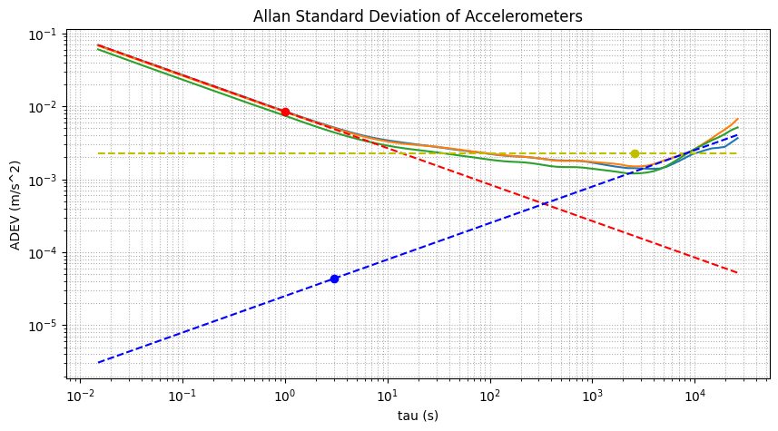

# NavSenseSim

A Python library for airborne sensors noise characterization and simulation. Utilizing the Allan variance method, NavSenseSim accurately determines noise parameters crucial for sensor simulation models. This approach offers robust capabilities to simulate sensors with high fidelity, ensuring realism in sensor behavior simulations.

For more info on Allan variance and noise modelling, please visit https://github.com/ethz-asl/kalibr/wiki/IMU-Noise-Model

## Project Structure

- **common**: Contains math functions, constants, and other utility scripts.
- **data**: Includes real IMU recorded data for Allan variance analysis.
- **docs**: Contains PDFs with related topics and HTML Jupyter Notebook reports of analysis and simulations performed.
- **noise**: Contains noise models (white, brown, pink...) and Allan variance calculation and analysis functions.
- **sensors**: Includes the IMU simulation module.

## TODOs

- [ ] Implement GPS sensor simulation
- [ ] Implement barometric altimeter simulation
- [ ] Implement magnetometer simulation
- [ ] Implement airspeed sensor simulation

## Allan Variance Analysis

The picture below shows the Allan variance analysis of a real accelerometer using a 15 hours dataset with more than 6 million of samples. This dataset exceeds the GitHub's 50 MB file size limit and therefore cannot be shared.



```
N = 8.4543e-03 m/s^2/sqrt(Hz)
B = 2.2557e-03 m/s^2
K = 4.3347e-05 m/s^3*sqrt(Hz)
Tc = 2.6e+03 s
```

## Example Usage

To get started, you can run the [imu_analysis_simulation.py](imu_analysis_simulation.py) script. This script processes IMU data, computes Allan variance to characterize noise, and then uses these characteristics to simulate sensor data. The output includes plots of the Allan variance and comparisons of real, ideal, and simulated sensor data.

```bash
python imu_analysis_simulation.py
```
This script can also be executed in sections delimited with `# %%` using VS Code or Spyder. This approach is better for bigger datasets, as it allows you to avoid loading and processing all the data each time a small modification is made to the script.

## License

This project is licensed under the MIT - see the [LICENSE](LICENSE) file for details.